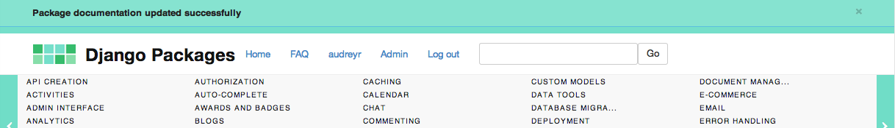

# jQuery MessageBar [](https://travis-ci.org/audreyr/messagebar) [](https://david-dm.org/audreyr/messagebar#info=devDependencies)

A top bar for notification messages. Dismiss it by clicking the x. Works with Django, but that's optional.

* Free software: MIT License (http://audreyr.mit-license.org/)

## Screenshot and Demo

Here is a screenshot of MessageBar being used on https://www.djangopackages.com:



To see a live demo of several MessageBars in action, see http://audreyr.github.io/messagebar/demo/.

* They correspond to Bootstrap's **default**, **primary**, **success**, **info**,
  **warning**, and **danger** styles.
* The default MessageBars are purposely plain. It's your job to change the CSS
  colors and font to match your site, of course.

To run the demo locally:

  ```bash
  npm install
  grunt
  ```

## Usage

1. Include jQuery:

  ```html
  <script src="http://ajax.googleapis.com/ajax/libs/jquery/2.0.3/jquery.min.js"></script>
  ```

2. Include plugin's code:

  ```html
  <link href="dist/jquery.messagebar.min.css" rel="stylesheet">
  <script src="dist/jquery.messagebar.min.js"></script>
  ```

3. Put your plugin HTML on your web page:

  ```html
  <div class="messagebar">
      <div class="container">
        This is a notification. You can click it away if you want.
        <button type="button" class="close" data-dismiss="message">&times;</button>
      </div>
  </div>
  ```

4. Call the plugin:

  ```javascript
  $(".messagebar").messageBar({
    slide: false
  });
  ```

  (Note: `slide: true` hasn't been implemented yet. See https://github.com/audreyr/messagebar/issues/1 for more info. If you feel like implementing that feature, go for it and send a pull request!)

### Setting Up jQuery MessageBar with Django Messages
  
jQuery MessageBar can easily be connected to Django's messages framework, allowing
your web application to display notifications as top bars that can be clicked
away. 

This is similar to the notification bars used in many popular web applications,
such as StackOverflow.

1. Add this to your base template:

  ```html
  
    <div class="messagebar messagebar-default {{ message.tags }}" id="message_{{ forloop.counter }}">
      <div class="container">
        {{ message }}
        <button type="button" class="close" data-dismiss="message">&times;</button>
      </div>
    </div>
  
  ```

2. Change the names of the classes in messagebar.css to match Django's built-in
message levels of:

  * debug
  * info
  * success
  * warning
  * error

See https://docs.djangoproject.com/en/dev/ref/contrib/messages/#message-tags
for more info.
